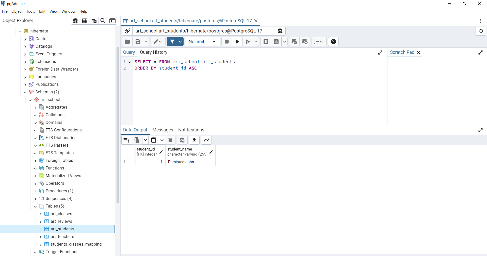

# Hibernate ORM Demo

Learn and play with Hibernate to map Java objects and PostgreSQL data

Implemented based on LinkedIn learning course:
[Java Persistence with JPA and Hibernate](https://www.linkedin.com/learning/java-persistence-with-jpa-and-hibernate)

## JPA implementation with Hibernate

**Tech stack**:
- JPA
- Hibernate
- PostgreSQL

### Prepare

- Install PostgreSQL Server on your local machine
- Install PostgreSQL Client: `pgAdmin` desktop app or `psql` console tool
- Connect to PostgreSQL Server by any client
- Create `hibernate` database to be used for this demo and switch to it
- Create env variables on your machine: `POSTGRESQL_USER_NAME`, `POSTGRESQL_USER_PASSWORD`
  in order to allow java app connect to `hibernate` database 
  and not to store credentials in repository

### Project setup

#### Gradle dependencies

Having stand-alone Java application (running without web server) we will use next libs:

```kotlin
dependencies {
    // https://mvnrepository.com/artifact/org.hibernate.orm/hibernate-core
    implementation("org.hibernate.orm:hibernate-core:6.6.1.Final")
    
    // https://mvnrepository.com/artifact/org.postgresql/postgresql
    implementation("org.postgresql:postgresql:42.7.4")
    
    compileOnly("org.projectlombok:lombok:1.18.28")
    annotationProcessor("org.projectlombok:lombok:1.18.28")
}
```

#### Persistence Unit configuration: XML

We should have JPA-Hibernate configuration in `persistance.xml` file
under `src/main/resources/META-INF` directory like this:

```xml
<?xml version="1.0" encoding="UTF-8"?>
<persistence version="3.0" xmlns="https://jakarta.ee/xml/ns/persistence" xmlns:xsi="http://www.w3.org/2001/XMLSchema-instance" xsi:schemaLocation="https://jakarta.ee/xml/ns/persistence https://jakarta.ee/xml/ns/persistence/persistence_3_0.xsd">
    <!-- Define Persistence Unit -->
    <persistence-unit name="art_school" transaction-type="RESOURCE_LOCAL">
        <provider>org.hibernate.jpa.HibernatePersistenceProvider</provider>
        <class>yevhent.demo.hibernate.entity.ArtStudent</class>
        <class>yevhent.demo.hibernate.entity.ArtTeacher</class>
        <class>yevhent.demo.hibernate.entity.ArtClass</class>
        <class>yevhent.demo.hibernate.entity.ArtReview</class>
        <properties>
            <property name="jakarta.persistence.jdbc.driver" value="org.postgresql.Driver" />
            <property name="jakarta.persistence.jdbc.url" value="jdbc:postgresql://localhost:5432/hibernate" />
            <property name="jakarta.persistence.jdbc.user" value="${env.POSTGRESQL_USER_NAME}" />
            <property name="jakarta.persistence.jdbc.password" value="${env.POSTGRESQL_USER_PASSWORD}" />
            <property name="hibernate.show_sql" value="true" />
        </properties>
    </persistence-unit>
</persistence>
```

Alternatively, we can define ENV properties separately like this
(in my case ENV variables was not loaded from `persistence.xml`, so I had to use such way):
```java
public class ArtSchoolFactory {

  public static EntityManagerFactory createEntityManagerFactory() {
    Map<String, String> properties = new HashMap<>();
    properties.put("jakarta.persistence.jdbc.user", System.getenv("POSTGRESQL_USER_NAME"));
    properties.put("jakarta.persistence.jdbc.password", System.getenv("POSTGRESQL_USER_PASSWORD"));
    return Persistence.createEntityManagerFactory("art_school", properties);
  }
} 
```

#### Persistence Unit configuration: Java

Another way is complete Java configuration:

- First add dependency for `Hikari` DataSource:

```kotlin
dependencies {
    //...
    implementation("com.zaxxer:HikariCP:6.1.0")
}
```

- Second implement `PersistenceUnitInfo` interface by completing next methods only 
  and leave other methods returning `null`:
```java
public class ArtSchoolPersistenceUnitInfo implements PersistenceUnitInfo {

  @Override
  public String getPersistenceUnitName() {
    return "art_school";
  }

  @Override
  public String getPersistenceProviderClassName() {
    return HibernatePersistenceProvider.class.getName();
  }

  @Override
  public PersistenceUnitTransactionType getTransactionType() {
    return PersistenceUnitTransactionType.RESOURCE_LOCAL;
  }

  @Override
  public DataSource getNonJtaDataSource() {
    HikariDataSource dataSource = new HikariDataSource();
    dataSource.setJdbcUrl("jdbc:postgresql://localhost:5432/hibernate");
    dataSource.setUsername(System.getenv("POSTGRESQL_USER_NAME"));
    dataSource.setPassword(System.getenv("POSTGRESQL_USER_PASSWORD"));
    return dataSource;
  }

  @Override
  public List<String> getManagedClassNames() {
    return List.of(ArtStudent.class.getName(), 
                   ArtTeacher.class.getName(), 
                   ArtClass.class.getName(), 
                   ArtReview.class.getName());
  }

  // leave other methods with no implementation
  @Override
  public SharedCacheMode getSharedCacheMode() {
    return null; 
  }
  
  // ...
}
```

- And use it to create `EntityManagerFactory` like this:
```java
EntityManagerFactory entityManagerFactory = new HibernatePersistenceProvider()
        .createContainerEntityManagerFactory(new ArtSchoolPersistenceUnitInfo(), new HashMap());
```

### Hibernate practice

Now, we are ready to create DB tables and implement JPA layer in java.

#### Challenge: Define "Art School" schema in PostgreSQL

**Task**:
- Create schema `art_school` in `hibernate` database.
- Create table `art_teacher` with fields `id` as primary key, `name`.
- Create table `art_student` with fields `id` as primary key, `name`.
- Create table `art_class` with fields `id` as primary key, `name`, `week day`,
  and `teacher_id` as reference to `teacher` table.
- Create mapping for `art_student` and `art_class` tables as many-to-many relation.
- Create table `review` with fields `id`, `comment`, `rating`,
  and `teacher_id` as reference to `teacher` table.

**Solution**:
```sql
CREATE SCHEMA IF NOT EXISTS art_school
    AUTHORIZATION postgres;
```
```sql
CREATE TABLE IF NOT EXISTS art_school.art_teachers(
    teacher_id   serial,
    teacher_name varchar(255),
    
    PRIMARY KEY (teacher_id)
);
```
```sql
CREATE TABLE IF NOT EXISTS art_school.art_students(
    student_id   serial,
    student_name varchar(255),
    
    PRIMARY KEY (student_id)
);
```
```sql
CREATE TABLE IF NOT EXISTS art_school.art_classes(
    class_id    serial,
    class_name  varchar(255),
    week_day    varchar(255),
    theacher_id int,

    PRIMARY KEY (class_id),
    FOREIGN KEY (theacher_id) REFERENCES art_school.art_teachers(teacher_id) 
        MATCH SIMPLE 
        ON UPDATE RESTRICT
        ON DELETE RESTRICT
);
```
```sql
CREATE TABLE IF NOT EXISTS art_school.students_classes_mapping(
    student_id int,
    class_id   int,
    
    PRIMARY KEY (student_id, class_id),
    FOREIGN KEY (student_id) REFERENCES art_school.art_students(student_id) 
        MATCH SIMPLE 
        ON UPDATE RESTRICT
        ON DELETE RESTRICT,
    FOREIGN KEY (class_id)   REFERENCES art_school.art_classes(class_id)
        MATCH SIMPLE 
        ON UPDATE RESTRICT
        ON DELETE RESTRICT
);
```
```sql
CREATE TABLE IF NOT EXISTS art_school.art_reviews(
    review_id      serial,
    review_comment varchar(255),
    rating         int,
    teacher_id     int,
    
    PRIMARY KEY (review_id),
    FOREIGN KEY (teacher_id) REFERENCES art_school.art_teachers(teacher_id)
        MATCH SIMPLE
        ON UPDATE RESTRICT
        ON DELETE RESTRICT
);
``` 

Data structure looks like this in pgAdmin:


#### Challenge: Define "Art School" classes in Java

**Task**:

- Create Java classes to map corresponding tables using `jakarta.persistence` annotations
- Implement standard Java methods using `lombok` annotations

**Solution example**:

```java
import jakarta.persistence.Entity;
import jakarta.persistence.Table;
import jakarta.persistence.Id;
import jakarta.persistence.GeneratedValue;
import jakarta.persistence.GenerationType;
import jakarta.persistence.Column;

import lombok.AllArgsConstructor;
import lombok.NoArgsConstructor;
import lombok.Getter;

@Entity
@Table(schema = "art_school", name = "art_teachers")
@NoArgsConstructor // Required: used by the JPA provider to create instances of the entity using reflection
@AllArgsConstructor // Optional: used by this app
@Setter // Optional: used by this app
@Getter // Optional: used by this app
public class ArtTeacher {

    @Id
    @GeneratedValue(strategy = GenerationType.IDENTITY)
    @Column(name = "teacher_id")
    private int id;

    @Column(name = "teacher_name")
    private String name;
}
```

Full list of Entities is [here](Jpa-and-Hibernate/src/main/java/yevhent/demo/hibernate/entity).

#### Challenge: "Art School" entity operations with Hibernate

**Task**: 

Implement java methods for next operations
- Save new Student object to DB: 
  - Create new Student object
  - Save that object using `EntityManager.persist()` method
  - Make sure new Student is saved to DB
- Update existing Student in DB: 
  - Get Student object using `EntityManager.find()` method
  - Set new name for that object
  - Make sure new name is saved to DB
- Attach new Student object:
  - Create new Student object
  - Attach that Student object to context using `EntityManager.merge()` method
  - Make sure new Student is saved to DB
- Attach existing Student object:
  - Create new Student object with existing `id`
  - Set new name for that object
  - Attach that Student object to context using `EntityManager.merge()` method
  - Make sure name of existing Student is updated in DB
- Detach existing Student in DB:
  - Get Student object using `EntityManager.find()` method
  - Set new name `John` for that object
  - Detach that object using `EntityManager.detach()` method
  - Set new name `Peter` for that object
  - Make sure `John` is only name saved to that Student in DB
- Detach and Attach existing Student:
  - Get Student object using `EntityManager.find()` method
  - Detach that object using `EntityManager.detach()` method
  - Set new name `Peter` for that object
  - Make sure no output in console about update statement 
  - Attach that object using `EntityManager.merge()` method
  - Set new name for that object
  - Make sure name of existing Student is updated in DB

**Solution examples**: 
    
- Create

```java
import jakarta.persistence.EntityManager;
import jakarta.persistence.EntityManagerFactory;
import yevhent.demo.hibernate.configuration.ArtSchoolFactory;
import yevhent.demo.hibernate.entity.ArtStudent;

public class PersistDemo {
  public static void main(String[] args) {

    try (EntityManagerFactory entityManagerFactory = ArtSchoolFactory.createEntityManagerFactory();
         EntityManager entityManager = entityManagerFactory.createEntityManager()) { // session is opened once EntityManager is provided
      entityManager.getTransaction().begin(); // begin Transaction in order to follow ACID within this method

      ArtStudent artStudent = new ArtStudent(0, "John"); // id = 0 is just default value, it will be ignored by Hibernate and generated by PostgreSQL
      entityManager.persist(artStudent); // "Hibernate: insert into art_school.art_students (student_name) values (?) returning student_id"
      // changes are in Hibernate context (in Java app)
      entityManager.getTransaction().commit(); // actual insert to DB
    } // session is closed by entityManager.close()
  }
}
```

The Student is saved to DB:



- Update
```java
public class FindAndUpdateDemo {
    public static void main(String[] args) {

        try (EntityManagerFactory entityManagerFactory = ArtSchoolFactory.createEntityManagerFactory();
             EntityManager entityManager = entityManagerFactory.createEntityManager()) {
            entityManager.getTransaction().begin();

            ArtStudent artStudent = entityManager.find(ArtStudent.class, 1);
            // Hibernate: select as1_0.student_id,as1_0.student_name from art_school.art_students as1_0 where as1_0.student_id=?
            // call to DB
            artStudent.setName("James");
            // Entity is already in Hibernate context, so no statements printed and Hibernate just does dirty checking
            entityManager.getTransaction().commit();
            // Hibernate: update art_school.art_students set student_name=? where student_id=?
            // call to DB
        }
    }
}
```

Name is updated in DB:


Full list of operations is [here](Jpa-and-Hibernate/src/main/java/yevhent/demo/hibernate/operation).


